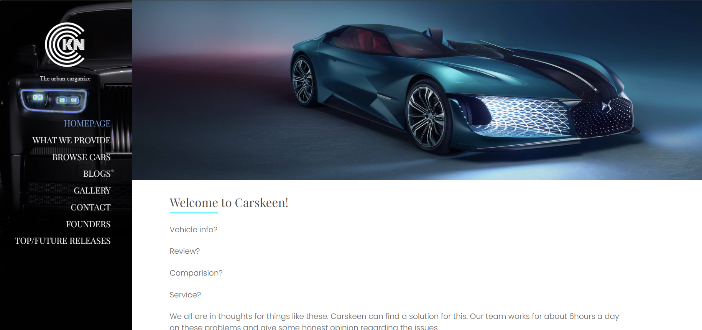
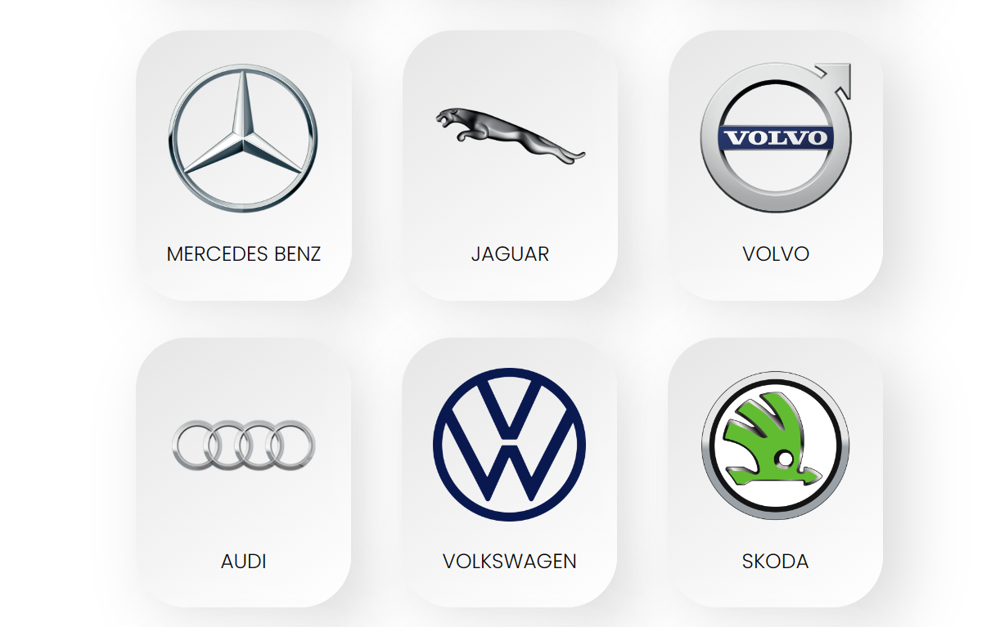

# Carskeen

# Main Page
  

Carskeen is a web application dedicated to automobile enthusiasts. It provides users with detailed information about various cars, including their specifications, features, and pricing. Built using HTML, CSS, and JavaScript, Carskeen offers a user-friendly interface and a visually appealing design.

## Design

Carskeen employs a **Neumorphic design** approach, which is a modern trend that focuses on soft, subtle, and extruded shapes to mimic physical objects. This design style creates a sense of depth and dimensionality, providing a tactile and visually appealing user interface. The minimalist and monochromatic color scheme, along with subtle shadows and highlights, enhances the overall user experience by making it feel more intuitive and familiar.

  

## Features
- **Design**: Incorporating Neumorphic design, Carskeen elegantly simulates real-world tactility and depth, enhancing user engagement through its soft, digital aesthetic
- **Car Catalog**: Browse through a comprehensive list of cars with detailed information.
- **Filter and Search**: Easily find cars based on specific criteria such as make, model, and price range.
- **Responsive Design**: Enjoy a seamless experience on both desktop and mobile devices.
- **Interactive UI**: Engage with dynamic elements for an enhanced user experience.
